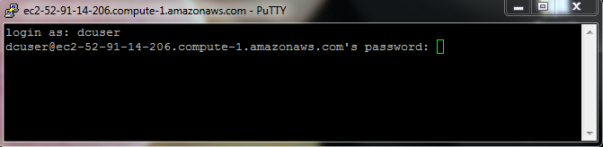

# Introduction to cloud computing

## Learning Objectives

* Understand benefits of working on a remote computer system
* Be able to connect to a cloud instance via **secure shell (SSH)**
* Check the available resources and file system on your remote machine
* Keep background processes working in the cloud with `tmux`

There are a number of reasons why accessing a remote machine is invaluable to any scientist working with large datasets.
In the early history of computing, working on a remote machine was standard practice - computers were bulky and expensive.
Today we work on laptops that are more powerful than the sum of the world's computing capacity 20 years ago, but many analyses (especially in genomics) won't work on these laptops and must be run on remote machines.

You'll know you need to start working in the cloud when...

* Your computer does not have enough resources to run the desired analysis (memory, processors, disk space, network bandwidth).
* Your computer is taking hours or days to get through an analysis.
* You cannot install software on your computer (application does not have support for your operating system, conflicts with other existing applications, etc.)

The cloud is a part of our everyday life (e.g. using Amazon, Google, Netflix, or an ATM involves remote computing).
The topic is fascinating but **this lesson says '5 minutes or less'** so let's get connected.


### The Shell
---


The **shell** is a program that presents a command line interface which allows you to control your computer using commands entered with a keyboard instead of controlling graphical user interfaces (GUIs) with a mouse/keyboard combination.
**The shell is an interpreter that helps translate our input into computer language.**

There are many reasons to learn about the shell.

* For most bioinformatics tools, you have to use the shell.
  There is no graphical interface.
  If you want to work in metagenomics or genomics you're going to need to use the shell.
* The shell gives you **power**.
  The command line gives you the power to do your work more efficiently and more quickly.
  When you need to do things tens to hundreds of times, knowing how to use the shell is transformative.
* Computational resources that can handle large datasets, such as clusters or cloud computing, require a working knowledge of Unix.

We will be using the shell on our laptops to connect to the cloud.
**How do we access the `shell`?**

## Exercises

---

## Setting up

For the duration of this workshop, we will be accessing data and tools required to analyze our data on a remote computer using the **Amazon's Elastic Compute Cloud (EC2)**.

### Connecting to a remote computer using Amazon EC2

This is the first and last place in these lessons where it will matter if you are using PC, Mac, or Linux. After we connect, we will all be on the same operating system/computing environment.

> To save time, your instructor will have launched an remote computer (instance) for you prior to the workshop.
> **Each instance will have an associated IP adresss listed in the etherpad which you will need to connect to the instance**.
> If you are following these lessons on your own, or after the workshop see the lesson on [cloud computing](https://github.com/datacarpentry/cloud-genomics/tree/gh-pages/lessons) for instructions on how to do this yourself.

**User Credentials** are case sensitive:

- Username: dcuser
- Password: data4Carp


#### **Windows users**

*Prerequisites*: You must have an SSH client.
There are several free options, but we will only discuss PuTTY. [[Download Putty.exe](http://www.chiark.greenend.org.uk/~sgtatham/putty/download.html)]

For Windows, you will have downloaded a separate program called PuTTy to allow you to use the shell.

1. Open `PuTTY`; In the 'Host Name (or IP address)' section paste in the IP address provided by your instructor (or the IP address of an instance you have provisioned yourself).
   *Keep the default selection 'SSH' and Port (22)*. <br />
   
1. Click 'Open' and you will be presented with a security warning.
   Select 'Yes' to continue to connect. <br />
   
1. In the final step, you will be asked to provide a login and password.
   **Note:** When typing your password, it is common in Unix/Linux not see see any asterisks (e.g. ****) or moving cursors.
   Just continue typing. <br />
   
1. You should now be connected!


#### **Mac/Linux users**

*Prerequisites*: The shell is already available on Mac and Linux computers.

On Linux search for `Terminal`

On Mac the shell is available through Terminal:
	`Applications -> Utilities -> Terminal`

Or click on the magnifying glass in the upper right of the Desktop and search for 'terminal' and/or look for the `terminal` icon.<br>


  1. Open the terminal and type the following command substituting 'ip_address' for the IP address your instructor will provide.
     *Be sure to pay attention to capitalization and spaces*

  ```
  $ ssh dcuser@ip_address
  ```

  1. You will receive a security message that looks something like the message below.
     Type 'yes' to proceed.

  ```
  The authenticity of host 'ec2-52-91-14-206.compute-1.amazonaws.com (52.91.14.206)' can't be established. ECDSA key fingerprint is SHA256:S2mMV8mCThjJHm0sUmK2iOE5DBqs8HiJr6pL3x/XxkI. Are you sure you want to continue connecting (yes/no)?
  ```

  1. In the final step, you will be asked to provide a login and password.
     **Note:** When typing your password, it is common in Unix/Linux not see see any asterisks (e.g. ****) or moving cursors.
	 Just continue typing.
  1. You should now be connected!

### **Verifying your connection and environment**

When you connect, it is typical to receive a welcome screen.
The Data Carpentry Amazon instances display this message upon connecting:


```
Welcome to Ubuntu 14.04.3 LTS (GNU/Linux 3.13.0-48-generic x86_64)

 * Documentation:  https://help.ubuntu.com/

  System information as of Sun Jan 24 21:38:35 UTC 2016

  System load:  0.0                Processes:           151
  Usage of /:   48.4% of 98.30GB   Users logged in:     0
  Memory usage: 6%                 IP address for eth0: 172.31.62.209
  Swap usage:   0%

  Graph this data and manage this system at:
    https://landscape.canonical.com/

  Get cloud support with Ubuntu Advantage Cloud Guest:
    http://www.ubuntu.com/business/services/cloud

12 packages can be updated.
10 updates are security updates.


Last login: Sun Jan 24 21:38:36 2016 from
```

You should also have a blinking cursor awaiting your command:

```
dcuser@ip-172-31-62-209 ~ $
```

## Bonus material
---

Now that we have connected we can move on to the Unix shell lesson.
There are however a few commands that tell you a little about the machine you have connected to:

  * `whoami` - shows your username on computer you have connected to

```
dcuser@ip-172-31-62-209 ~ $ whoami
dcuser
```

  * `df -h` - shows space on hard drive (Under the column 'Mounted on' row that has `/` as the value shows the value for the main disk)

```
dcuser@ip-172-31-62-209 ~ $ df -h
Filesystem      Size  Used Avail Use% Mounted on
udev            2.0G   12K  2.0G   1% /dev
tmpfs           396M  792K  395M   1% /run
/dev/xvda1       99G   48G   47G  51% /
none            4.0K     0  4.0K   0% /sys/fs/cgroup
none            5.0M     0  5.0M   0% /run/lock
none            2.0G  144K  2.0G   1% /run/shm
none            100M   36K  100M   1% /run/user

# -h option = 'human readable output'
```

  * `cat /proc/cpuinfo` - shows detail information on how many processors (CPUs) the machine has

```
dcuser@ip-172-31-62-209 ~ $ cat /proc/cpuinfo
processor  : 0
vendor_id	: GenuineIntel
cpu family	: 6
model		: 62
model name	: Intel(R) Xeon(R) CPU E5-2670 v2 @ 2.50GHz
stepping	: 4
microcode	: 0x415
cpu MHz		: 2494.060
cache size	: 25600 KB
physical id	: 0
siblings	: 2
core id		: 0
cpu cores	: 2
apicid		: 0
initial apicid	: 0
fpu		: yes
fpu_exception	: yes
cpuid level	: 13
wp		: yes
flags		: fpu vme de pse tsc msr pae mce cx8 apic sep mtrr pge mca cmov pat pse36 clflush mmx fxsr sse sse2 ht syscall nx rdtscp lm constant_tsc rep_good nopl xtopology eagerfpu pni pclmulqdq ssse3 cx16 pcid sse4_1 sse4_2 x2apic popcnt tsc_deadline_timer aes xsave avx f16c rdrand hypervisor lahf_lm xsaveopt fsgsbase smep erms
bogomips	: 4988.12
clflush size	: 64
cache_alignment	: 64
address sizes	: 46 bits physical, 48 bits virtual
power management:

processor	: 1
vendor_id	: GenuineIntel
cpu family	: 6
model		: 62
model name	: Intel(R) Xeon(R) CPU E5-2670 v2 @ 2.50GHz
stepping	: 4
microcode	: 0x415
cpu MHz		: 2494.060
cache size	: 25600 KB
physical id	: 0
siblings	: 2
core id		: 1
cpu cores	: 2
apicid		: 2
initial apicid	: 2
fpu		: yes
fpu_exception	: yes
cpuid level	: 13
wp		: yes
flags		: fpu vme de pse tsc msr pae mce cx8 apic sep mtrr pge mca cmov pat pse36 clflush mmx fxsr sse sse2 ht syscall nx rdtscp lm constant_tsc rep_good nopl xtopology eagerfpu pni pclmulqdq ssse3 cx16 pcid sse4_1 sse4_2 x2apic popcnt tsc_deadline_timer aes xsave avx f16c rdrand hypervisor lahf_lm xsaveopt fsgsbase smep erms
bogomips	: 4988.12
clflush size	: 64
cache_alignment	: 64
address sizes	: 46 bits physical, 48 bits virtual
power management:
```

  * `tree -L 1` - shows a tree view of the file system 1 level below your current location.


```
dcuser@ip-172-31-62-209 ~ $ tree -L 1

├── dc_sample_data
├── Desktop
├── Downloads
├── FastQC
├── openrefine-2.6-beta.1
├── R
└── Trimmomatic-0.32

7 directories, 0 files

# -L option = 'Level'
# -L 1 option = One level deep
```

## Executing long-running jobs in the cloud

---

Often when working in the cloud, certain tasks or analyses require a long period of run time (hours or even days).
It's usually not feasible to keep an SSH connection active for the entire duration.
You need to close your laptop and go home, or you need to install updates on your desktop, or something like that.

Closing an active SSH connection will terminate any processes you have started in the associated *session*.
To keep long-running tasks going even after you have disconnected, you need to start a separate session that will continue running in the background after you close your SSH connection.

Closing an active SSH connection (such as when you need to close your laptop or let your desktop go into sleep mode) will terminate any processes you have started on the remote machine.
There are a few ways to do this, but we'll be discussing a program called `tmux`, which stands for "terminal multiplexer".

### Overview of `tmux`

A *session* can be thought of as a window for `tmux`.
In a graphical environment like Windows or Mac OS, it's common to have multiple windows open for different tasks.
You might open a browser window to do a literature search, and then a terminal window to analyze your data on the command line.
The term *multi-tasking* became popular when this feature was introduced in computing, as did terms like *minimize* (to hide a window) and *maximize* (to unhide a window).

The `tmux` program allows you to multi-task in your terminal, with different "windows" running simultaneously.
The terms we use when talking about `tmux` are a bit different, but the concepts are essentially the same.

- Instead of saying **window** we say **session**.
- Instead of saying **minimize** we say **detach**.
- Instead of saying **maximize** we say **attach**.

### Starting a new session

You can start a new session and give it a descriptive name:

```
$ tmux new -s session_name

# option -s = 'session name'
```

This creates a session with the name 'session_name'.
As you work, this session will stay active until you explicitly close it.
Even if you disconnect from your machine, the jobs you start in this session will run till completion.

### Detaching from a session

If you're in an active `tmux` session, you can detach and return to your default shell by hitting the `ctrl` and `b` keys at the same time, followed by the `d` key.
This will take you back to the terminal you saw before creating the `tmux` session.
The `tmux` session will continue to run in the background, even if you need to disconnect from the machine.

### Re-connecting to a session

To connect to an existing session:

```
$ tmux attach -t session_name
# -t option = 'target'
```

### Listing active sessions

To see a list of all active `tmux` sessions:

```
$ tmux ls
```

### Switch sessions

If you have multiple sessions running, you can switch between sessions:

```
tmux switch -t session_name
```

### Kill a session

You can end sessions:

```
tmux kill-session -t session_name
```

### Resources on cloud computing
* [Amazon EC2](http://aws.amazon.com/ec2/)
* [Microsoft Azure](https://azure.microsoft.com/en-us/)
* [Google Cloud Platform](https://cloud.google.com/)
* [CyVerse Atmosphere](http://www.cyverse.org/atmosphere)

Learn more about cloud computing in bioinformatics
Fusaro VA, Patil P, Gafni E, Wall DP, Tonellato PJ (2011) Biomedical Cloud Computing With Amazon Web Services. [PLoS Comput Biol 7(8): e1002147](http://journals.plos.org/ploscompbiol/article?id=10.1371/journal.pcbi.1002147)


### Resources on the shell
* [FOSSwire cheat sheet](http://fosswire.com/post/2007/08/unixlinux-command-cheat-sheet/)
* [Software Carpentry cheat sheet](https://github.com/swcarpentry/boot-camps/blob/master/shell/shell_cheatsheet.md)
* [Explain shell](http://explainshell.com )
* [Command line fu](http://www.commandlinefu.com)
