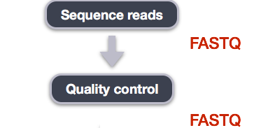
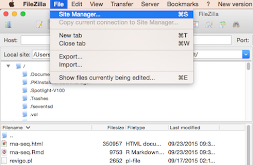
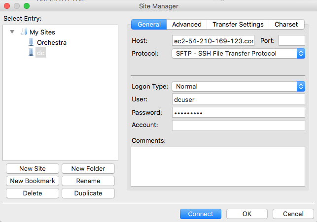

Approximate time: 120 minutes

## Learning Objectives:

* Understand the bioinformatics workflows and data standards
* Learn about the FASTQ format
* Understand nucleotide quality scores
* Examine error profiles for QC analysis
* Improve quality of data by removing low quality nucleotides
* Automate the QC steps using a shell script


## Bioinformatics workflows

When working with NGS data, the raw reads you get off of the sequencer will need to pass through a number of  different tools in order to generate your final desired output. The execution of this set of tools in a specified order is commonly referred to as a *workflow* or a *pipeline*. 

An example of the workflow we will be using for our variant calling analysis is provided below with a brief description of each step. 


1. Quality control - Assessing quality using FastQC
2. Quality control - Trimming and/or filtering reads (if necessary)
3. Align reads to reference genome 
4. Perform post-alignment clean-up
5. Variant calling

These workflows in bioinformatics adopt a plug-and-play approach in that the output of one tool can be easily used as input to another tool without any extensive configuration. Having standards for data formats is what makes this feasible. Standards ensure that data is stored in a way that is generally accepted and agreed upon within the community. The tools that are used to analyze data at different stages of the workflow are therefore built under the assumption that the data will be provided in a specific format.  


## Quality Control

The first step in the variant calling work flow is to take the FASTQ files received from the sequencing facility and assess the quality of the sequence reads. 



### FASTQ format

The [FASTQ](https://en.wikipedia.org/wiki/FASTQ_format) file format is the defacto file format for sequence reads generated from next-generation sequencing technologies. This file format evolved from FASTA in that it contains sequence data, but also contains quality information. Similar to FASTA, the FASTQ file begins with a header line. The difference is that the FASTQ header is denoted by a `@` character. For a single record (sequence read) there are four lines, each of which are described below:

|Line|Description|
|----|-----------|
|1|Always begins with '@' and then information about the read|
|2|The actual DNA sequence|
|3|Always begins with a '+' and sometimes the same info in line 1|
|4|Has a string of characters which represent the quality scores; must have same number of characters as line 2|

Let's use the following read as an example:

```
@HWI-ST330:304:H045HADXX:1:1101:1111:61397
CACTTGTAAGGGCAGGCCCCCTTCACCCTCCCGCTCCTGGGGGANNNNNNNNNNANNNCGAGGCCCTGGGGTAGAGGGNNNNNNNNNNNNNNGATCTTGG
+
@?@DDDDDDHHH?GH:?FCBGGB@C?DBEGIIIIAEF;FCGGI#########################################################
```

As mentioned previously, line 4 has characters encoding the quality of each nucleotide in the read. The legend below provides the mapping of quality scores (Phred-33) to the quality encoding characters. ** *Different quality encoding scales exist (differing by offset in the ASCII table), but note the most commonly used one is fastqsanger* **

 ```
 Quality encoding: !"#$%&'()*+,-./0123456789:;<=>?@ABCDEFGHI
                   |         |         |         |         |
    Quality score: 0........10........20........30........40                                
```
 
Using the quality encoding character legend, the first nucelotide in the read (C) is called with a quality score of 31 and our Ns are called with a score of 2. **As you can tell by now, this is a bad read.** 

Each quality score represents the probability that the corresponding nucleotide call is incorrect. This quality score is logarithmically based and is calculated as:

	Q = -10 x log10(P), where P is the probability that a base call is erroneous

These probabaility values are the results from the base calling algorithm and dependent on how much signal was captured for the base incorporation. The score values can be interpreted as follows:

|Phred Quality Score |Probability of incorrect base call |Base call accuracy|
|:-------------------|:---------------------------------:|-----------------:|
|10	|1 in 10 |	90%|
|20	|1 in 100|	99%|
|30	|1 in 1000|	99.9%|
|40	|1 in 10,000|	99.99%|
|50	|1 in 100,000|	99.999%|
|60	|1 in 1,000,000|	99.9999%|

Therefore, for the first nucleotide in the read (C), there is less than a 1 in 1000 chance that the base was called incorrectly. Whereas, for the the end of the read there is greater than 50% probabaility that the base is called incorrectly.

### Assessing quality with FastQC

The quality scores are useful in determining whether a sample is good or bad. Rather than looking at quality scores for each individual read, we use a tool called [FastQC](http://www.bioinformatics.babraham.ac.uk/projects/fastqc/) to looks at quality collectively across all reads within a sample. The image below is a plot that indicates a (very) good quality sample:


On the x-axis you have the base position in the read, and on the y-axis you have quality scores. In this example, the sample contains reads that are 40 bp long. For each position, there is a box plotted to illustrate the distribution of values (with the whiskers indicating the 90th and 10th percentile scores). For every position here, the quality values do not drop much lower than 32 -- which if you refer to the table above is a pretty good quality score. The plot background is also color-coded to identify good (green), acceptable (yellow), and bad (red) quality scores.  


Now let's take a look at a quality plot on the other end of the spectrum. 


Here, we see positions within the read in which the boxes span a much wider range. Also, quality scores drop quite low into the 'bad' range, particularly on the tail end of the reads. When you encounter a quality plot such as this one, the first step is to troubleshoot. Why might we be seeing something like this? 

The *FASTQC* tool produces several other diagnostic plots to assess sample quality, in addition to the one plotted above. 

#### Project set-up

Project organization is one of the most important parts of a sequencing project, but is often overlooked in the excitement to get a first look at new data. 

Every computational analysis you do is going to spawn many files, and inevitability, you'll want to run some of those analysis again. Sensible project directory structure and file names will make your analysis traversable by you and your collaborators.

Your future self will thank you.

##### Creating an NGS project directory structure  

Create a working directory for your NGS analysis
```bash
	$ cd
	# this command takes us to the home directory

	$ mkdir dc_workshop
	$ cd dc_workshop
```

Create three subdirectories
```bash
	$ mkdir data docs results
```

Move our sample data to our working (home) directory
```bash
	$ mv ~/.dc_sampledata_lite/untrimmed_fastq/ ~/dc_workshop/data/
```

#### Run FastQC

Now that we have our directory structure set up, and we know about what information is stored in a FASTQ file, the next step is to examine quality metrics for our data.

1. Navigate to the `untrimmed_fastq` directory:
   
```bash
$ cd data/untrimmed_fastq/
```
To run the fastqc program, we call it from its location in `~/FastQC`.  *FastQC* will accept multiple file names as input, so we can use the *.fastq wildcard.
2. Run FastQC on all fastq files in the directory

```bash
$ ~/FastQC/fastqc SRR097977.fastq SRR098027.fastq
```

Take a quick look at what files were generated:

```bash
$ ls -l 
```

You should see a `.zip` and `.html` file that was created for each FASTQ file. Now, let's create a home for our results:

```bash
$ mkdir ~/dc_workshop/results/fastqc_untrimmed_reads
```
3. Next, move the files there (recall, we are still in ``~/dc_workshop/data/untrimmed_fastq/``)
   
```bash 
$ mv *.zip ~/dc_workshop/results/fastqc_untrimmed_reads/
$ mv *.html ~/dc_workshop/results/fastqc_untrimmed_reads/
```

#### Results

Let's take a closer look at the files generated by FastQC:
```bash
$ cd ~/dc_workshop/results/fastqc_untrimmed_reads/
$ ls -lh
```

##### HTML reports
The .html files contain the final reports generated by *FastQC*, let's take a closer look at them. Transfer the report for SRR097977.fastq over to your laptop via [FileZilla](https://github.com/devbioinfoguy/HPC-genomics/blob/master/lessons/5.Data-rountripping.md#using-the-filezilla-gui-all-platforms).

######Filezilla - Step 1

Open *FileZilla*, and click on the File tab. Choose 'Site Manager'.
 


######Filezilla - Step 2

Within the 'Site Manager' window, do the following: 

1. Click on 'New Site', and name it something intuitive (e.g. dc or Data_Carpentry)
2. Host: address of your cloud instance (e.g. ec2-...) 
3. Protocol: SFTP - SSH File Transfer Protocol
4. Logon Type: Normal
5. User: dcuser
6. Password: data4Carp
7. Click 'Connect'
	


######Filezilla - Step 3

In FileZilla, on the left side of the screen navigate to the location you would like to save the file, and on the right side of the screen navigate through your remote directory to the file `/home/dcuser/dc_workshop/results/fastqc_untrimmed_reads/SRR097977_fastqc.html`. Double click on the .html file to transfer a copy, or click and drag over to the right hand panel.

Open the .html file to view the report.

######FastQC report

***FastQC is just an indicator of what's going on with your data, don't take the "PASS"es and "FAIL"s too seriously.***

FastQC has a really well documented [manual page](http://www.bioinformatics.babraham.ac.uk/projects/fastqc/) with [more details](http://www.bioinformatics.babraham.ac.uk/projects/fastqc/Help/) about all the plots in the report. 

We recommend looking at [this post](http://bioinfo-core.org/index.php/9th_Discussion-28_October_2010) for more information on what bad plots look like and what they mean for your data.

Below are two of the most important analysis modules in FastQC, the **"Per base sequence quality"** plot and the **"Overrepresented sequences"** table. 

The **"Per base sequence quality"** plot provides the distribution of quality scores across all bases at each position in the reads.


The **"Overrepresented sequences"** table displays the sequences (at least 20 bp) that occur in more than 0.1% of the total number of sequences. This table aids in identifying contamination, such as vector or adapter sequences. SRR09797 did not return any overrepresented sequences.


##### .zip files   

Let's go back to the terminal now. The other output of FastQC is a .zip file. These .zip files need to be unpacked with the `unzip` program. If we try to `unzip` them all at once:
```bash
	$ unzip *.zip
```

Did it work? 

No, because `unzip` expects to get only one zip file. Welcome to the real world.
We *could* do each file, one by one, but what if we have 500 files? There is a smarter way.
We can save time by using the simple shell `for loop` to iterate through the list of files in *.zip.

After you type the first line, you will get a special '>' prompt to type next next lines.  
You start with 'do', then enter your commands, then end with 'done' to execute the loop.

```bash
$ for zip in *.zip
  do
    unzip $zip
  done
```

Note that in the first line, we create a variable named `zip`.  After that, we call that variable with the syntax `$zip`. `$zip` is assigned the value of each item (file) in the list *.zip, once for each iteration of the loop.

This loop is basically a simple program. When it runs, it will run unzip 
once for each file (whose name is stored in the $zip variable). The contents of each file will be unpacked into a separate directory by the unzip program.

The 'for loop' is interpreted as a multipart command.  If you press the up arrow
on your keyboard to recall the command, it will be shown like so:
```bash
    for zip in *.zip; do unzip $zip; done
```

When you check your history later, it will help your remember what you did!

#### Document your work

To save a record, let's `cat` all fastqc `summary.txt` files into one `fastqc_summaries.txt` and move this to ``~/dc_workshop/docs``. You can use wildcards in paths as well as file names.  Do you remember how we said `cat` is really meant for concatenating text files?

```bash    
$ cat */summary.txt > ~/dc_workshop/docs/fastqc_summaries.txt
```

### How to clean reads using *Trimmomatic*
#### A detailed explanation of features

Once we have an idea of the quality of our raw data, it is time to trim away adapters and filter out poor quality score reads. To accomplish this task we will use [Trimmomatic](http://www.usadellab.org/cms/?page=trimmomatic).

*Trimmomatic* is a java based program that can remove sequencer specific reads and nucleotides that fall below a certain threshold. *Trimmomatic* can be multithreaded to run quickly. 

Because *Trimmomatic* is java based, it is run using the `java -jar path/to/trimmomatic-0.32.jar` command:

```bash
$ java -jar path/to/trimmomatic-0.33.jar SE \
-threads 2 \
inputfile \
outputfile \
OPTION:VALUE... # DO NOT RUN THIS
```    
`java -jar` calls the Java program, which is needed to run *Trimmomatic*, which is a 'jar' file (`trimmomatic-0.33.jar`). A 'jar' file is a special kind of java archive that is often used for programs written in the Java programming language.  If you see a new program that ends in '.jar', you will know it is a java program that is executed `java -jar` <*location of program .jar file*>.  

The `SE` argument is a keyword that specifies we are working with single-end reads. We have to specify the `-threads` parameter because *Trimmomatic* uses 16 threads by default.

The next two arguments are input file and output file names.  These are then followed by a series of options that tell the program exactly how you want it to operate. *Trimmomatic* has a variety of options and parameters:

* **_-threads_** How many processors do you want *Trimmomatic* to run with?
* **_SE_** or **_PE_** Single End or Paired End reads?
* **_-phred33_** or **_-phred64_** Which quality score do your reads have?
* **_SLIDINGWINDOW_** Perform sliding window trimming, cutting once the average quality within the window falls below a threshold.
* **_LEADING_** Cut bases off the start of a read, if below a threshold quality.
* **_TRAILING_** Cut bases off the end of a read, if below a threshold quality.
* **_CROP_** Cut the read to a specified length.
* **_HEADCROP_** Cut the specified number of bases from the start of the read.
* **_MINLEN_** Drop an entire read if it is below a specified length.
* **_TOPHRED33_** Convert quality scores to Phred-33.
* **_TOPHRED64_** Convert quality scores to Phred-64.


#### Running Trimmomatic 

Change directories to the untrimmed fastq data location:

```bash
$ cd ~/dc_workshop/data/untrimmed_fastq
```
Since the *Trimmomatic* command is complicated and we will be running it a number of times, let's draft the command in a **text editor**, such as Sublime, TextWrangler or Notepad++. When finished, we will copy and paste the command into the terminal.

For the single fastq file `SRR097977.fastq`, the command is:

```bash
$ java -jar ~/Trimmomatic-0.32/trimmomatic-0.32.jar SE \
-threads 2 \
SRR097977.fastq \
SRR097977.fastq_trim.fastq \
SLIDINGWINDOW:4:20 \
MINLEN:20
```
*The backslashes at the end of the lines allow us to continue our script on new lines, which helps with readability of some long commands.*

This command tells *Trimmomatic* to run on a fastq file containing Single-End reads (``SRR097977.fastq``, in this case) and to name the output file ``SRR097977.fastq_trim.fastq``. The program will remove nucleotides using a sliding window of size 4 that will remove those bases if their average quality score is below 20. The entire read will be discarded if the length of the read after trimming drops below 20 nucleotides.

```bash
TrimmomaticSE: Started with arguments: SRR097977.fastq SRR097977.fastq_trim.fastq SLIDINGWINDOW:4:20 MINLEN:20
Automatically using 2 threads
Quality encoding detected as phred33
Input Reads: 4346025 Surviving: 4060625 (93.43%) Dropped: 285400 (6.57%)
TrimmomaticSE: Completed successfully
```

So that worked and we have a new fastq file.

```bash
$ ls SRR097977*
SRR097977.fastq  SRR097977.fastq_trim.fastq
```

Now we know how to run *Trimmomatic* but there is some good news and bad news.  
One should always ask for the bad news first.  Trimmomatic only operates on 
one input file at a time and we have more than one input file.  The good news?
We already know how to use a `for` loop to deal with this situation.

Before we run our `for` loop, let's remove the file that we just created:

```bash
$ rm *trim.fastq
```
```bash
$ for infile in SRR097977.fastq SRR098027.fastq
  do
    outfile=${infile}_trim.fastq
    java -jar ~/Trimmomatic-0.32/trimmomatic-0.32.jar SE -threads 2 $infile $outfile SLIDINGWINDOW:4:20 MINLEN:20
  done
```

In the 'for loop', do you remember how a variable is assigned the value of each item in the list in turn?  We can call it whatever we like.  This time it is called 'infile'.  Note that the third line of this for loop is creating a second variable called 'outfile'.  We assign it the value of $infile with '_trim.fastq' appended to it.  The variable is wrapped in curly brackets '{}' so the shell knows that whatever follows is not part of the variable name $infile.  There are no spaces before or after the '='.

Now let's keep our directory organized. Make a directory for the trimmed fastq files: 

`$ mkdir ../trimmed_fastq`

Move the trimmed fastq files to the new directory:

`$ mv *trim.fastq ../trimmed_fastq/`

## Automating the QC workflow
Now that we know how to use the tools to perform the QC, let's automate the process using a shell script. We will use the same commands, with a few extra "echo" statements to give us feedback.

Create a script called `qc.sh`:

	$ nano qc.sh

```bash
#!/bin/bash

# Change directories into the folder with the untrimmed fastq files
cd ~/dc_workshop/data/untrimmed_fastq/

# Run FastQC on the untrimmed files
echo "Running fastqc on untrimmed fastq files..."
~/FastQC/fastqc *.fastq
mkdir -p ~/dc_workshop/results/fastqc_untrimmed_reads

# Move FastQC results
echo "saving untrimmed results..."
mv *.zip ~/dc_workshop/results/fastqc_untrimmed_reads/
mv *.html ~/dc_workshop/results/fastqc_untrimmed_reads/

# Change directories to the FastQC results folder
cd ~/dc_workshop/results/fastqc_untrimmed_reads/

# Unzip the FastQC zip files
echo "Unzipping..."
for zip in *.zip
do
  unzip $zip
done

# Create a summary text file for all FastQC runs
echo "saving..."
cat */summary.txt > ~/dc_workshop/docs/fastqc_summaries.txt

# Run Trimmomatic
echo "Running Trimmomatic..."
cd ~/dc_workshop/data/untrimmed_fastq/
for infile in *.fastq; do
  # Create names for the output trimmed files
	outfile=$infile\_trim.fastq;
 # Run Trimmomatic command
	java -jar ~/Trimmomatic-0.32/trimmomatic-0.32.jar SE -threads 2 $infile $outfile SLIDINGWINDOW:4:20 MINLEN:20;
done

# Move trimmed files to the trimmed fastq folder
mv *trim.fastq ../trimmed_fastq/
```
----
